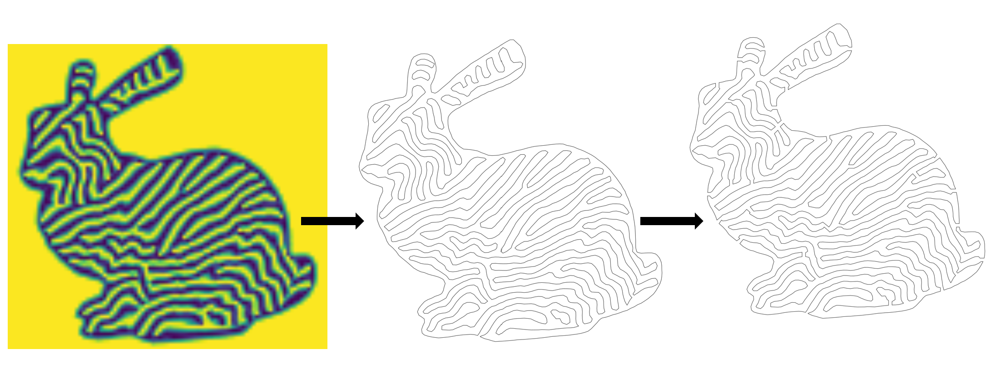

# Iso-contours extractor




Extract the iso-contours of a scalar field and stitch them together into a single path. Part of the [Orientable Dense Cyclic Infill for Anisotropic Appearance Fabrication](https://github.com/mfx-inria/anisotropic_appearance_fabrication) project translated using the Taichi library. Project carried out as part of an end-of-second-year internship at La Prépa des INP, Nancy, France. 
 

 
## Clone the repository

```
git clone --recursive https://github.com/AntoineMarion1/isocontour_extractor.git
```

## Install Conda environment and Python Module Dependencies

The code is written in Python 3.10 and it depends on: 


- [taichi](https://github.com/taichi-dev/taichi) 
- [tqdm](https://github.com/tqdm/tqdm)
- [svgpathtools](https://github.com/mathandy/svgpathtools)
- the local library [`src/cglib`](src/cglib)


Be careful, Taichi supports Python versions from 3.7 to 3.10. The following commands should be run from the repository root directory:

```
conda create --env cglib python=3.10
conda activate cglib
conda install pip
pip install --user -e .
pip install taichi
pip install tqdm
pip install svgpathtools
```

## Install Inkscape

Inkscape is a program for opening, creating and editing SVG files. Please download it to open the results exported in this format.

- [Inkscape](https://inkscape.org/release/inkscape-1.3.2/)